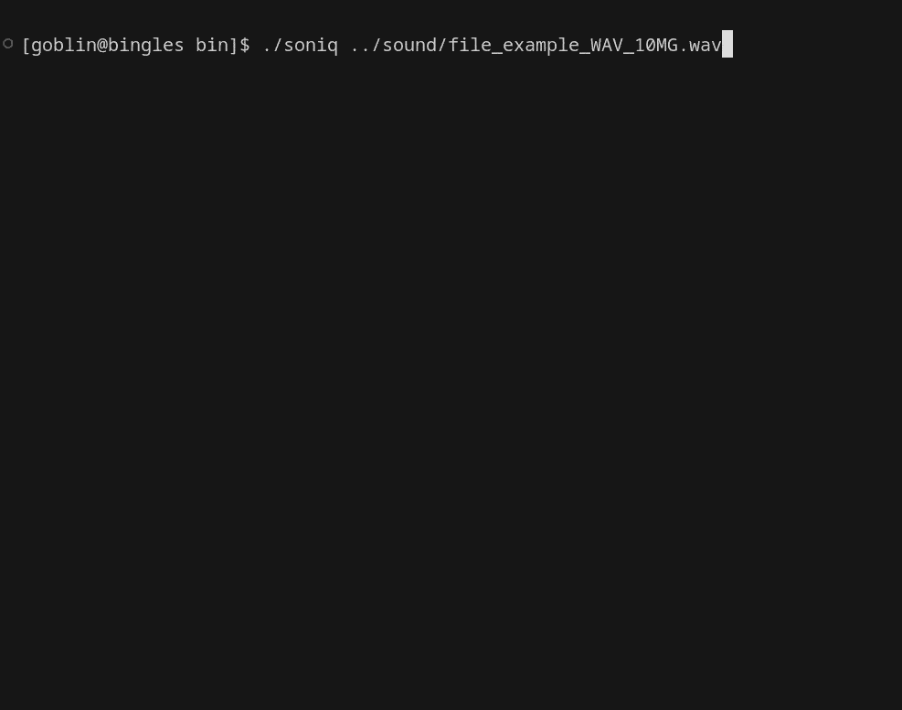

# soniq

soniq is a C++ program that plays a user-selected audio file with real-time sound output and displays an audio visualiser using either the DFT (Discrete Fourier Transform) algorithm or the radix-2 Cooley-Tukey Fast Fourier Transform (FFT).

## Demo (so far)



## Requirements

-   CMake >= 3.10
-   C++17-compatible compiler (e.g. `clang++` or `g++`)
-   (Optional) `clang-tidy` for static analysis

## Build Instructions

```sh
mkdir build
cd build
cmake ..
make
```

The final executable will be located at:

```sh
./bin/soniq
```

## Run File

```sh
./bin/soniq
```
